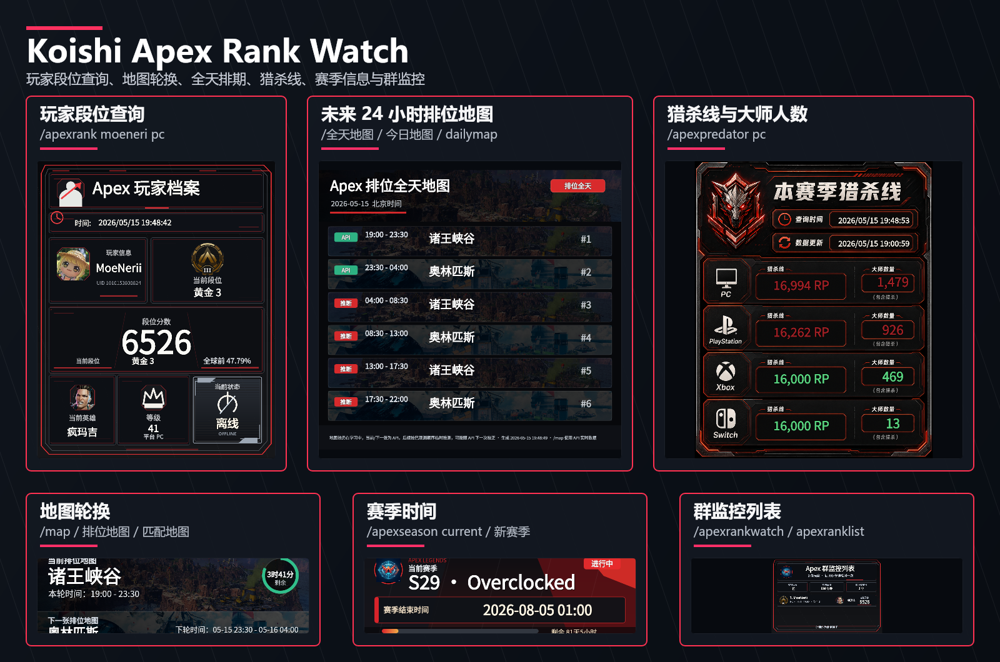

# koishi-plugin-apexrankwatch

[](https://www.npmjs.com/package/koishi-plugin-apexrankwatch)
[](https://koishi.chat/)
[](https://github.com/moeneri/koishi-plugin-apexrankwatch)
[](#许可证)

Koishi 版 Apex Rank Watch。填入 Apex Legends API Key 后，机器人可以查询玩家段位、地图轮换、赛季时间、猎杀线，并在群聊中持续监控排位分变化。

2.1 版在 2.0 图片卡片、地图、赛季、猎杀线、黑名单、权限与赛季关键词自动回复能力基础上，补齐 AstrBot 版 `/全天地图`、地图池学习闭环、字体检测下载和显式文字输出模式，同时保留 Koishi 版独有的 `/apexremark` 备注功能。

当前版本：`2.1.0`。

## 快速开始

在 Koishi 控制台插件市场搜索并安装 `koishi-plugin-apexrankwatch`，然后在插件配置里填写 `apiKey`。

也可以在 Koishi 项目目录中手动安装：

```bash
npm install koishi-plugin-apexrankwatch
```

如果使用 pnpm 或 yarn：

```bash
pnpm add koishi-plugin-apexrankwatch
yarn add koishi-plugin-apexrankwatch
```

安装后可以先试这几个命令：

```text
/apexhelp
/apexrank moeneri pc
/map
/全天地图
/匹配地图
/apexseason current
/apexpredator pc
/apexrankwatch moeneri pc
/apex_download
```

## 实际效果

下图是使用真实 API 与 Koishi 沙箱命令生成的图片合集，包含玩家查询、分数变化、监控添加、监控列表、地图、赛季和猎杀线卡片。



## 功能亮点

- **图片化输出**：玩家档案、分数变化、监控添加、监控列表、地图轮换、赛季信息、猎杀线均优先输出 PNG 图片。
- **玩家查询**：展示段位、RP、等级、UID、在线状态、当前英雄、英雄击杀排名与全球排名百分比。
- **群内监控**：按群保存监控玩家，定时检测排位分变化并推送通知。
- **地图轮换**：支持排位地图和三人赛匹配地图，展示当前地图、下一张地图和剩余时间。
- **全天地图**：支持 `/全天地图` 查询未来 24 小时排位地图排期。当前/下一张以 Mozambique API 为锚点，后续地图在学习闭环后按已确认地图池推断；未闭环时会自动每小时学习。
- **赛季信息**：支持当前赛季、指定历史赛季和群内“赛季”关键词自动回复。
- **猎杀线**：查询本赛季各平台大师数量与猎杀底分，可按平台过滤。
- **输出模式**：默认图片模式，也可将 `outputMode` 改为 `text`，让主要查询命令返回适合 QQ 群聊的紧凑文字。
- **字体下载**：Linux / Docker 环境缺少中文字体时，可使用 `/apex_download` 从字体资源仓库下载到本地缓存，插件包不内置大字体。
- **权限与黑名单**：支持用户黑名单、玩家黑名单、运行时黑名单、群白名单、主人账号和私聊开关。
- **数据兼容**：兼容旧 Koishi 数据结构、AstrBot 风格数据、snake_case 配置与逗号分隔名单。

图片生成失败时会自动回退为文字输出，不会影响基础查询。

## 命令

### 查询

| 命令 | 说明 |
| --- | --- |
| `/apexhelp` | 查看图片帮助卡。 |
| `/apexrank <玩家名\|uid:...> [平台]` | 查询玩家段位信息。未指定平台时会按 PC、PlayStation、Xbox、Switch 自动尝试。 |
| `/map` | 查询排位地图轮换。 |
| `/匹配地图` | 查询三人赛匹配地图轮换。 |
| `/全天地图` | 查询未来 24 小时排位地图排期。 |
| `/apexseason [赛季号\|current]` | 查询当前或指定赛季信息。 |
| `/apexpredator [平台]` | 查询猎杀线和大师数量。 |

### 监控

| 命令 | 说明 |
| --- | --- |
| `/apexrankwatch <玩家名\|uid:...> [平台]` | 将玩家加入当前群排位监控。 |
| `/apexranklist` | 查看当前群监控列表。 |
| `/apexremark <玩家名\|uid:...> [平台] [备注]` | 设置或清除监控玩家备注。备注最长 32 字符，会清理换行与控制字符。 |
| `/apexrankremove <玩家名\|uid:...> [平台]` | 从当前群移除玩家监控。 |

### 管理

| 命令 | 说明 |
| --- | --- |
| `/apextest` | 测试插件状态和主动消息能力。 |
| `/apex_download` | 检测或下载中文字体缓存。 |
| `/apexblacklist <add\|remove\|list\|clear> <玩家ID>` | 管理运行时玩家黑名单。 |
| `/赛季关闭` | 关闭当前群“赛季”关键词自动回复。 |
| `/赛季开启` | 开启当前群“赛季”关键词自动回复。 |

## 常用别名

- 查询玩家：`/apex查询`、`/视奸`
- 添加监控：`/apex监控`、`/持续视奸`
- 查看列表：`/apex列表`
- 设置备注：`/apex备注`
- 移除监控：`/apex移除`、`/取消持续视奸`
- 排位地图：`/地图`、`/排位地图`、`/apexmap`、`/apexrankmap`
- 全天地图：`/全天排位地图`、`/今日地图`、`/今日排位地图`、`/dailymap`
- 赛季查询：`/apex赛季`、`/新赛季`
- 猎杀线：`/apex猎杀`、`/猎杀`
- 黑名单：`/apex黑名单`、`/不准视奸`、`/apexban`
- 字体下载：`/apexdownload`、`/apexfont`、`/apex字体`、`/apex字体下载`
- 帮助：`/apex帮助`、`/apexrankhelp`

## 参数说明

平台参数支持：`pc`、`ps`、`ps4`、`ps5`、`playstation`、`xbox`、`x1`、`switch`、`ns`、`nintendo`。保存和查询时会规范化为 `PC`、`PS4`、`X1`、`SWITCH`。

UID 查询支持 `uid:` 或 `uuid:` 前缀：

```text
/apexrank uid:0000000000000 pc
/apexrankwatch uuid:0000000000000 pc
```

同名玩家可能在多个平台存在记录，添加监控、设置备注或移除监控时建议显式填写平台。

## 配置

必填配置只有 `apiKey`。留空时插件仍可加载，但玩家查询、群监控和猎杀线不可用。

Koishi 控制台会按分组展示配置项。推荐使用 camelCase 字段；从旧版迁移时，snake_case 字段和 `foo,bar` / `foo，bar` 逗号分隔名单仍会被兼容读取。

| 配置项 | 默认值 | 说明 |
| --- | --- | --- |
| `apiKey` | 空 | Apex Legends API Key。 |
| `debugLogging` | `false` | 输出脱敏调试日志，用于排查 API 返回结构和错误原因。 |
| `checkInterval` | `2` | 排位分监控轮询间隔，单位为分钟。 |
| `timeout` | `10000` | HTTP 请求超时时间，单位为毫秒。 |
| `maxRetries` | `3` | API 请求失败后的最大重试次数。 |
| `minValidScore` | `1` | 最低有效排位分，低于该值会视为异常并跳过通知。 |
| `allowPrivate` | `true` | 是否允许私聊使用查询、帮助、地图、赛季和猎杀线命令。 |
| `ownerQq` | 空列表 | 主人账号 ID / QQ 号列表，拥有管理权限。 |
| `userBlacklist` | 空列表 | 禁止使用插件的用户 ID / QQ 号列表。 |
| `whitelistEnabled` | `false` | 是否开启群白名单模式。开启后只有白名单群可以使用插件。 |
| `whitelistGroups` | 空列表 | 群白名单 ID 列表。 |
| `blacklist` | 空列表 | 全局玩家黑名单，禁止查询和监控这些玩家 ID / UID。 |
| `queryBlocklist` | 空列表 | 查询黑名单，禁止查询和监控这些玩家 ID / UID。 |
| `outputMode` | `image` | 消息输出模式。`image` 为图片模式，`text` 为紧凑文字模式。 |
| `fontAutoDownload` | `true` | 图片模式下缺少中文字体时是否自动下载字体缓存。 |
| `fontDownloadUrl` | 空 | 自定义中文字体下载地址。留空时使用 `moeneri/apexrankwatch-assets` 的官方字体资源。 |
| `dataDir` | `./data/apexrankwatch` | 数据与图片缓存目录。旧版 `groups.json` 与 AstrBot 风格数据会自动兼容。 |

## API Key 与数据来源

玩家查询、群监控和猎杀线依赖 Apex Legends API Key。你可以在 Koishi 控制台的插件配置里填写 `apiKey`。

如果你的 Key 还没有完成验证，请到 `https://portal.apexlegendsapi.com/discord-auth` 绑定 Discord。未验证、失效或被限流的 Key 可能导致查询失败；插件会把常见鉴权和限流错误转成更明确的提示。

数据来源：

- 玩家查询、地图轮换、猎杀线来自 `api.mozambiquehe.re`。
- 当前赛季倒计时来自 `apexlegendsstatus.com`。
- 指定赛季信息来自 `apexseasons.online`。

第三方数据仅供参考，请以游戏内实际显示为准。

## 数据文件

默认数据目录为 `./data/apexrankwatch`，可通过 `dataDir` 修改。

- `groups.json`：群监控数据。
- `settings.json`：运行时黑名单和赛季关键词开关。
- `daily_map_pool_state.json`：全天地图的地图池学习状态，字段使用 snake_case，兼容 AstrBot 迁移数据。
- `fonts/`：`/apex_download` 下载的中文字体缓存。
- `*_cards/`：运行时生成的图片卡片缓存。
- `assets/`：地图、英雄、段位、在线状态和猎杀线模板素材。

## 从 2.0 升级到 2.1

- 2.1 新增 `/全天地图`，会在 `dataDir/daily_map_pool_state.json` 中学习并保存排位地图池闭环状态。
- 2.1 新增 `outputMode`，默认仍为图片模式；需要纯文字输出时改为 `text`。
- 2.1 新增 `/apex_download`、`fontAutoDownload` 和 `fontDownloadUrl`，用于 Linux / Docker 环境自动下载中文字体。字体来自独立资源仓库，不会打进 npm 插件包。

## 从 1.x 升级到 2.x

- 2.0 新增图片生成依赖 `@napi-rs/canvas`，部署前请确认 Node.js `>=18` 且系统架构受支持。
- 2.0 会发布 `assets/` 素材目录，手动打包或本地链接时不要遗漏该目录。
- 旧版监控数据会自动兼容；如果你修改了 `dataDir`，请确保旧数据仍在对应目录。
- 名单类配置建议在 Koishi 控制台中逐项填写；旧版逗号分隔字符串仍可继续读取。
- `/apexremark` 是 Koishi 版保留功能，不会影响旧的查询和监控命令。

## 注意事项

- 地图轮换、玩家段位和猎杀线来自第三方 API，网络波动或 API 限流时可能查询失败。
- 赛季时间会统一按北京时间展示。
- 监控通知依赖 Koishi 适配器的主动消息能力；如果当前平台不支持主动消息，查询命令仍可正常使用。
- 插件使用 `@napi-rs/canvas` 生成图片，并随 npm 包发布 `assets/` 素材目录。如果部署环境缺少对应平台的 canvas 原生包，请先确认 Node.js 版本和系统架构。
- Linux / Docker 如果图片中文显示为方块或问号，请先执行 `/apex_download`；无法访问 GitHub 时可把 `fontDownloadUrl` 改为自己的镜像地址。
- 在 Koishi 沙箱里测试图片消息时，请在沙箱插件配置中开启 `fileServer.enabled`，否则浏览器无法读取机器人返回的本地图片文件。

## 开发与测试

```bash
npm test
npm run build
npm pack --dry-run
```

## 链接

- GitHub：[moeneri/koishi-plugin-apexrankwatch](https://github.com/moeneri/koishi-plugin-apexrankwatch)
- npm：[koishi-plugin-apexrankwatch](https://www.npmjs.com/package/koishi-plugin-apexrankwatch)

## 许可证

MIT
